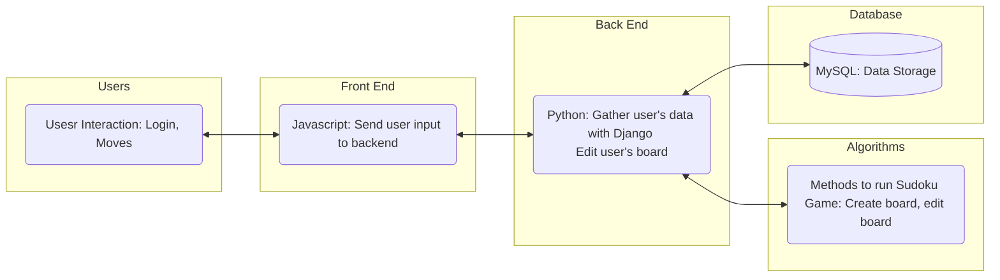

#### System Architecture

```mermaid
flowchart LR
subgraph Users
    A(Usesr Interaction: Login, Moves)
end

subgraph Front End
	B(Javascript: Send user input to backend)
end
	
subgraph Back End
	C(Python: Gather user's data with Django \nEdit user's board)
end

subgraph Algorithms
    D(Methods to run Sudoku Game: Create board, edit board)
end

subgraph Database
	E[(MySQL: Data Storage)]
end

A <--> B
B <--> C
C <--> D
C <--> E
```

