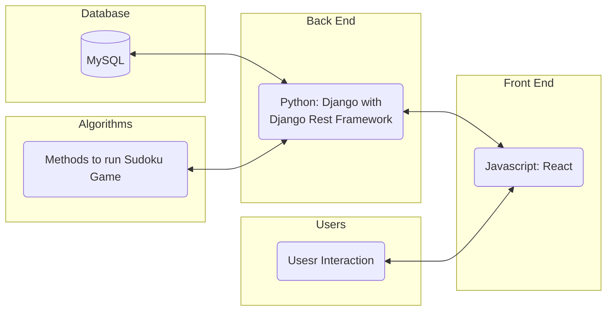

#### System Architecture

```mermaid
flowchart RL
subgraph Users
    D(Usesr Interaction)
end

subgraph Front End
	A(Javascript: React)
end
	
subgraph Back End
	B(Python: Django with \nDjango Rest Framework)
end

subgraph Algorithms
    E(Methods to run Sudoku Game)
end

subgraph Database
	C[(MySQL)]
end

A <--> B
B <--> C
A <--> D
B <--> E
```

